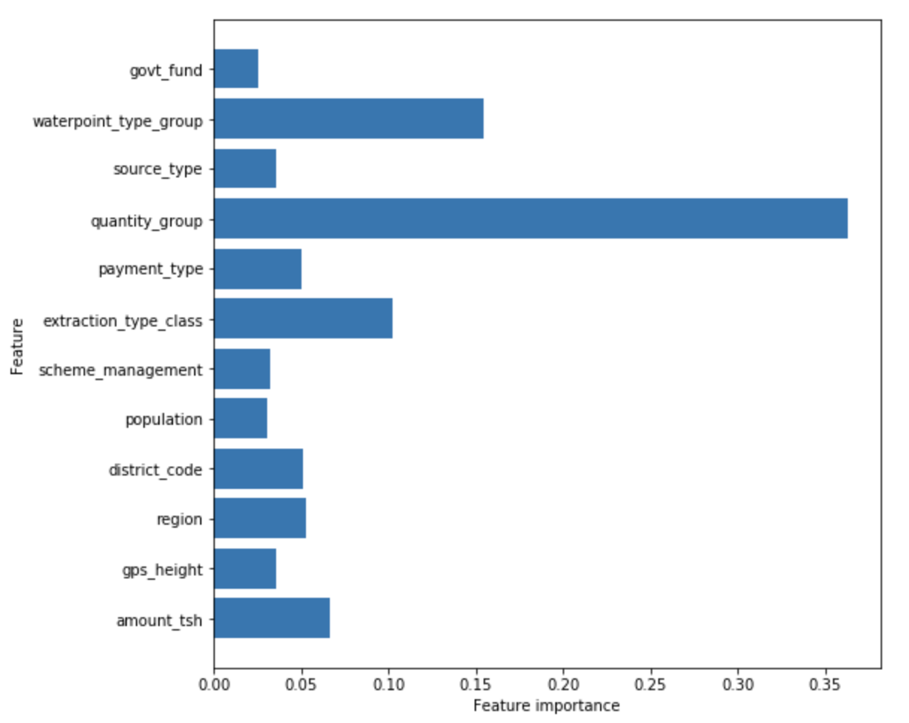

# Tanzanian Water Well Classification

**Author**: [Jeremy Pagirsky](https://github.com/jeremypagirsky)

## Overview

This project seeks to examine the predictive factors underlying water well functionality in Tanzania. Like many African nations, Tanzania/Zanzibar have been subject to European colonization, resulting in political destabilization, poverty, hunger, and resource scarcity. 

One potential present-day impact of colonization is the dependency on colonizing nations with large sums of resources and capital (e.g., Germany, United Kingdom). Because of this, one of the main objectives is to examine the extent to which Tanzanian governmentally-funded vs externally-funded wells play a role in functionality.

## Data

Data on over 59000 water wells in Tanzania up to the year 2013 was supplied by the Flatiron School. This data is part of a [DrivenData competition](https://www.drivendata.org/competitions/7/pump-it-up-data-mining-the-water-table/page/23/)

## Methods

Water well funding was split between wells funded by the Tanzanian government and those funded by other sources. Four model types (Logistic Regression, Decision Tree Classifier, Random Forest Classifier, XGBoost) were tested and compared for accuracy in their predictions for water well functionality. A Random Forest classifier was the model type of choice and tuned to optimize accuracy.

## Results

The Random Forest classifier was 73.5% accurate in classifying water well functionality.




## Conclusions

**The type of funding is a weak predictor in water well functionality.** Water well functionality is difficult to predict based on the funding source.

**The amount of water in a well plays a large role in its functionality.** This model demonstrates that the amount of water in the well itself is a major predictor in its functionality.

**The method of water extraction predicts water well functionality.** Various methods are used to extract water, which can also predict the well's functionality.

## Future Work

This is the first iteration of this project and has examined more general geographic, infrastructural, and geopolitical data. For future iterations, this project requires more robust tuning techniques to optimize model functioning. For the data per se, I would like to explore specific geographic data (`longitude`, `latitude`) and utilize maps to assist the model's predictions. For infrastructural data, I would like to further explore `construction_year` and research more viable imputation and null-handling methods for that variable. Additionally, due to the notable disparities of water access between urban and rural regions, I would like this project to make deeper examinations of this dynamic.


## For More Information

Please review the full analysis in [the Jupyter Notebook](./Tanzania_Waterpump_Classification.ipynb) or the [presentation](./).

For any additional questions, please contact ***Jeremy Pagirsky (jeremy.pagirsky@gmail.com)**

## Repository Structure

```
├── README.md                                  <- The README for reviewers of this project
├── Tanzania_Waterpump_Classification.ipynb    <- Narrative documentation of analysis in Jupyter notebook
├── .pdf       <- PDF version of project presentation
└── images                                     <- Images of visualizations
```# Tanzanian_Water_Wells
